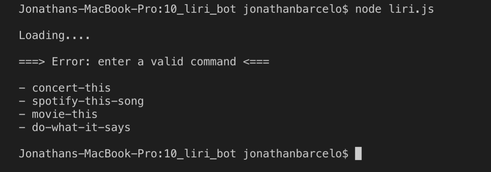
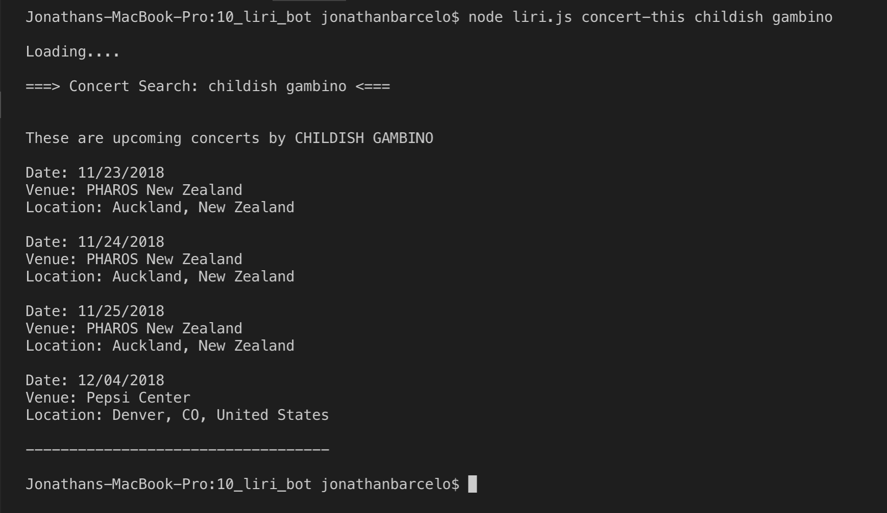
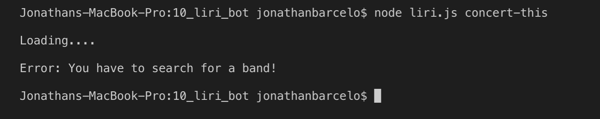
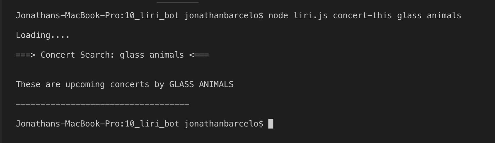
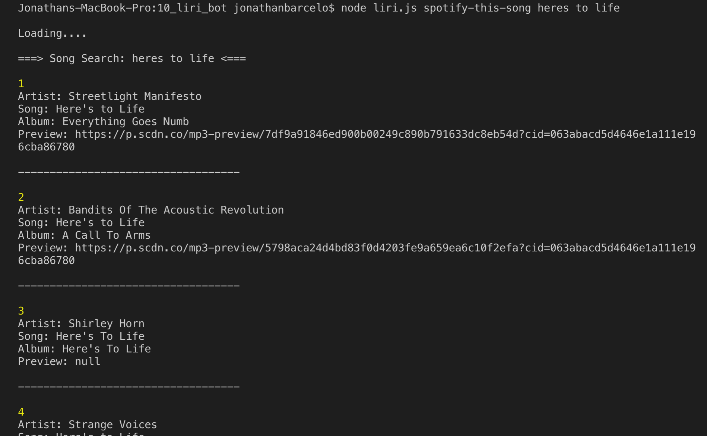
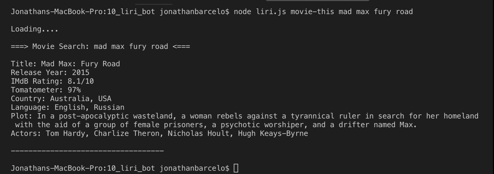
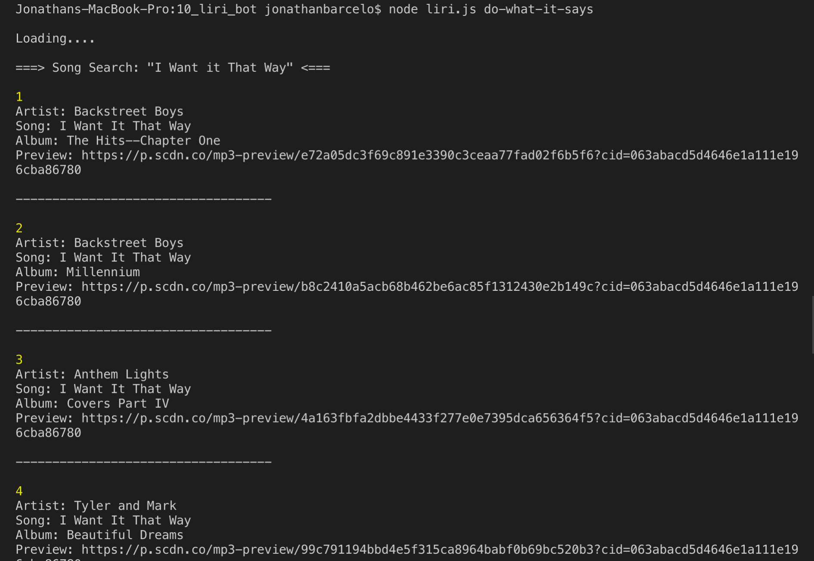

# Assignment-10: LIRI-BOT


## What it is

The LIRI bot is a node.js application that can take in commands and return data based on parameters set by the user. 


##What it can do

There are four *userCommands* that the LIRI bot can process:

* **concert-this** to search the BandsInTown API for concerts from a specific artist
* **spotify-this-song** to search the Spotify API for song matches based on keywords
* **movie-this** to search the OMDB API for specific movie information
* **do-what-it-says** to execute a userCommand stored inside the [random.txt](random.txt) file in this directory.


##How it works

With the exception of *do-what-it-says*, each **userCommand** must be accompanied by a **userEntry**. These occupy *positions 2 and 3* in the process.argv array, respectively. The userEntry can be anything you want it to be, depending on what you are searching for. 

Remember, LIRI is a server side application, so you will need to run the commands from your terminal:

**Like so:** node liri.js *userCommand* *userEntry*

__*Note1:*__ The userEntry can be multiple words, with spaces, thanks to a loop in line 20 of [liri.js](liri.js) that appends all subsequent indexes of the process.argv array to userEntry as a single string.  

__*Note2:*__ If at any moment your forget the possible userCommands, simply execute LIRI on its own:




###concert-this

LIRI uses the BandsInTown API and leverages the moment and request npm modules to return upcoming shows from a specific artist:



Should the user fail to include a userEntry, LIRI will alert the user and stop the function.



Should there be no upcoming concerts, there will be no results to dispay.




###spotify-this-song

Thanks to the spotify npm module, we can run a spotify.search function that returns an array of potential song matches (up to 20). 



__*Note:*__ Should the user fail to include a userEntry, LIRI will default to *The Sign*, by Ace of Base.

__*NOTE2:*__ In order to use LIRI on your own device, you must creat a .env file with the following text within:

```
# Spotify API keys

SPOTIFY_ID=[YOUR-OWN-ID]
SPOTIFY_SECRET=[YOUR-OWN-SECRET]
```
This keeps individual users' keys safe, as your unique .env file is part of [.gitignore](.gitignore) and will never be copied to a repository.

 
###movie-this

The OMDB API returns movie information based on the userEntry.



__*NOTE:*__ Should the user fail to include a userEntry, LIRI will default to *Mr. Nobody*.


###do-what-itsays

Using the fs npm module, we can read the text inside of [random.txt](random.txt) and transform it into an array using the *split* method. These values are then fed back into LIRI and processed accordingly.



*NOTE:* This userCommand does not require a userEntry, as it is already provided in the source text.